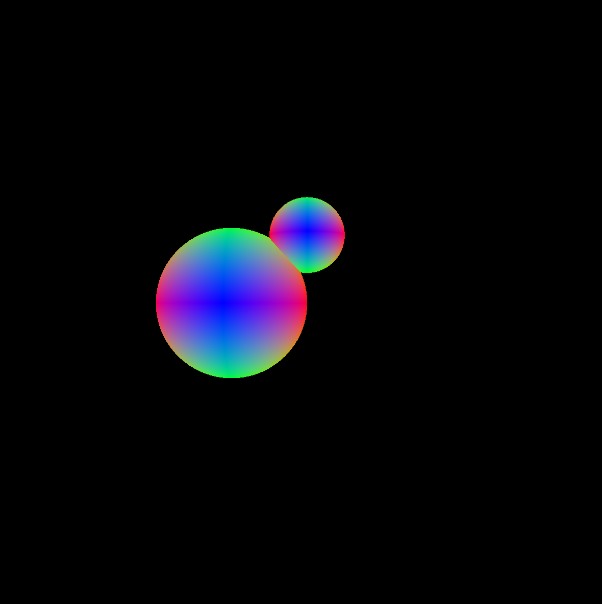
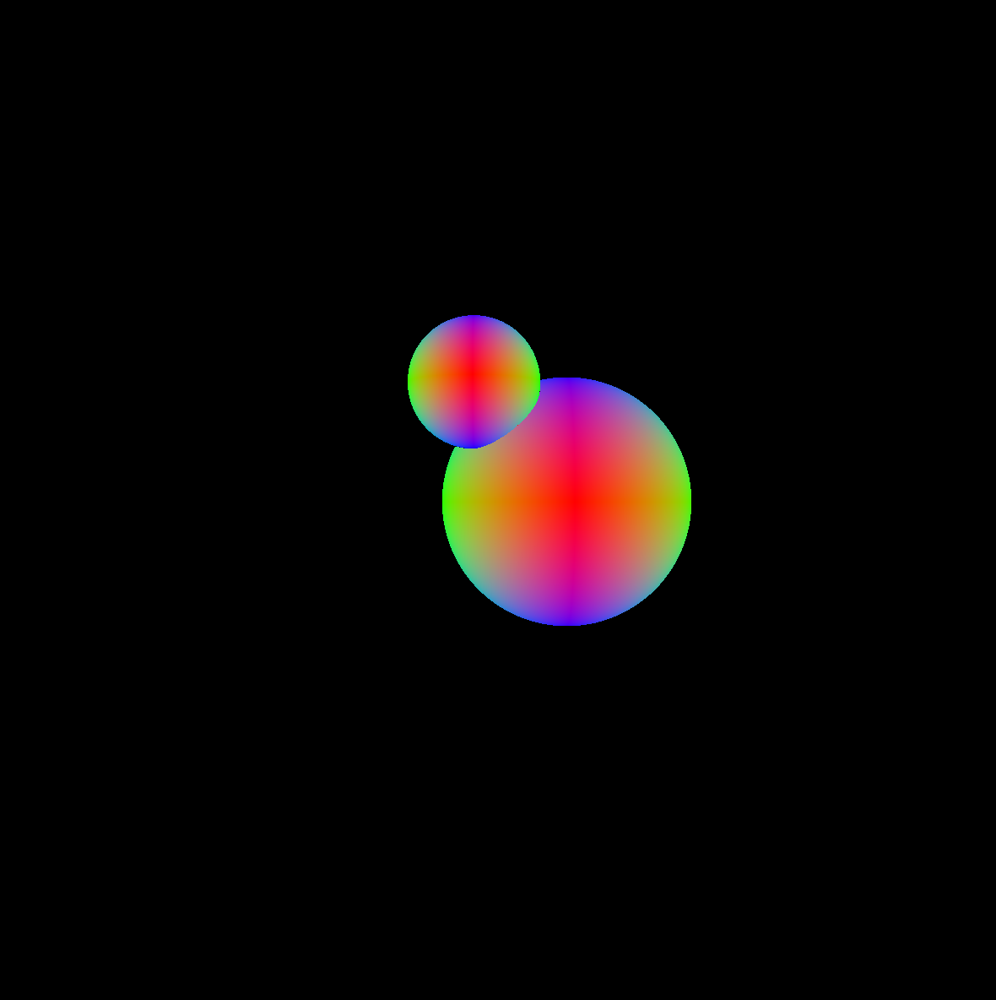
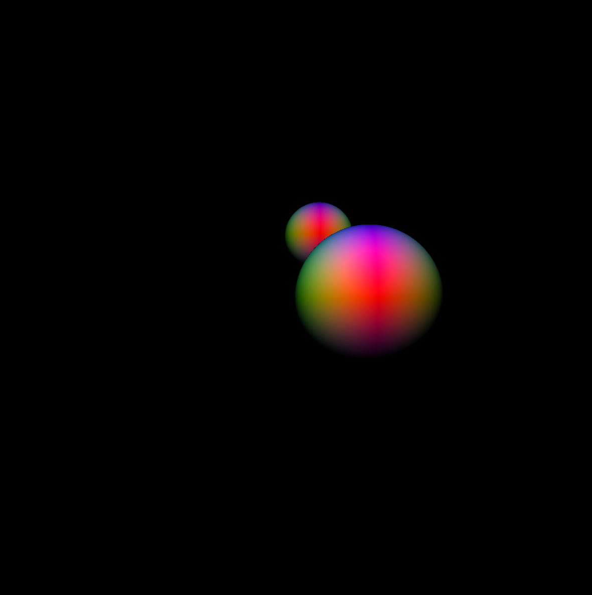
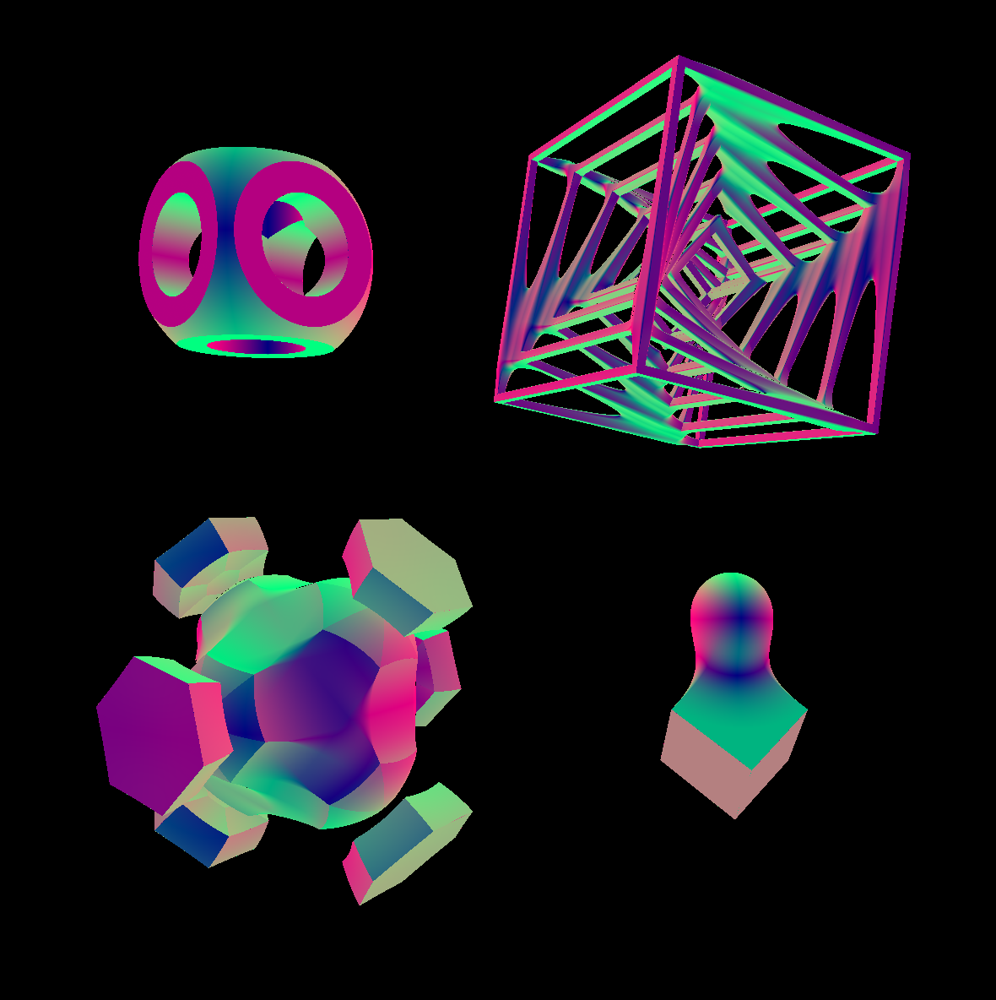
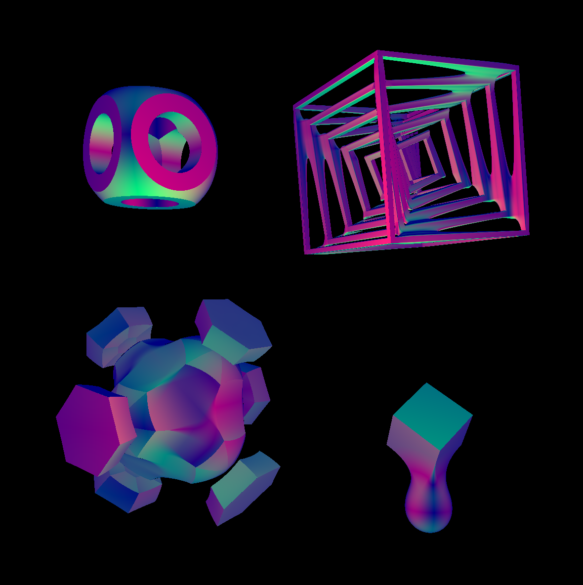

# Learning OpenGL (Ongoing)

An interactive OpenGL project exploring different rendering techniques utilizing raytracing, raymarching, and signed distance functions (SDFs).

## Current Features

### 1. Simple Raytracer
A basic raytracing implementation with ray-sphere surface intersection, lambertian lighting calculations, and shadow detection. Demo shows two animated spheres.

<p>
  
  
</p>

### 2. Simple Raymarcher
A raymarching renderer that uses signed distance fields (SDFs) to implicitly represent the geometry of the scene. Renderer uses sphere raymarching to draw the same scene as before, but with spheres coloured differently.

<p>
  
  
</p>


### 3. Playing around with Signed Distance Functions (SDFs)
Exploration of various signed distance functions to create complex geometric shapes. Utilizes various operations to combine different geometries including union, intersect, subtraction and smooth blending. Animated shapes using translation and rotation transformations.

<p>
  
  
</p>


## Build and Run

```bash
$ make
$ ./app
```

## Controls

| Key | Action |
|-----|--------|
| `1` | Switch to raytracer demo |
| `2` | Switch to raymarcher demo |
| `3` | Switch to SDF demo |
| `SPACE` | Toggle lighting on/off |
| `ESC` | Exit program |
